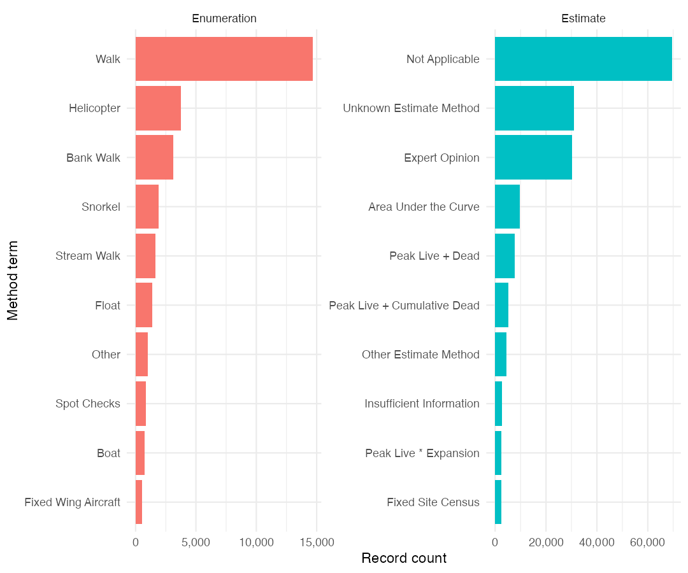

# Applying the guidance in practice

Next we summarize the substantive updates to the Type 1--6 guidance and how it should be applied during NuSEDS data entry and review.

## What is new in this guidance

Compared to table-only interpretation, the updated guidance:

- Uses a property-first decision sequence (rather than a table lookup).
- Separates enumeration methods (field) from estimation methods (analysis).
- Applies explicit qualifier codes for conservative downgrades (coverage, timing, visibility, documentation, and method-known gaps).
- Treats combined-method estimates as component-based workflows so weaker components are not concealed.
- Encourages recording quantitative uncertainty (CV/SE) where available.


## Legacy method vocabulary context

NuSEDS stores historical method terminology across multiple legacy labels. To support implementation planning, we reviewed method distributions in both `ENUMERATION_METHODS` and `ESTIMATE_METHOD` and retained the most frequent terms for interpretability, with longer-tail terms preserved through controlled mapping in Appendix C.

```{r method-field-top-terms, fig.width=6.0, fig.height=5.2, fig.cap="Top 10 method terms in NuSEDS SEN method fields (enumeration and estimate)."}

```

## How to apply the guidance moving forward

For most users, the simplest way to apply this guidance is through the **Escapement Estimate Type Toolkit** (R Shiny application):

- <https://dfo-pac-sci-dev.shinyapps.io/smn-escapement-toolkit/>

The toolkit guides users through the same decision sequence described in this report and produces (i) a final estimate Type (1--6) and (ii) explicit qualifier/downgrade codes. Users should copy the toolkit outputs (Type and qualifiers) into their SEN and into the **NuSEDS bulk upload tool** fields used to store estimate-type classification and justification.

### Authoritative decision-key logic and change requests

The authoritative decision-key logic is maintained as a version-controlled YAML file in the toolkit repository:

- <https://github.com/dfo-pacific-science/smn-escapement-estimates-toolkit/blob/main/matrix_key/structured_dichotomous_key.yaml>

Requests to update the logic (new method terms, revised thresholds, clarified combination rules, etc.) should be submitted as a GitHub issue in that repository (preferred) or emailed to **FADSDataStewardship-GestiondesdonneesSFDA@dfo-mpo.gc.ca**.

### What must be recorded

Uploads should include enough method and evidence context that downstream users can interpret both the assigned Type and any conservative qualifiers. In practice, this means recording:

- the primary enumeration and estimation methods;
- key qualifiers (coverage, uptime, breach/bypass, timing, visibility, and any infilling/interpolation context);
- documentation evidence sufficient for independent interpretation; and
- quantitative uncertainty where available.

A compact, single-table rule summary is provided in Appendix A.
